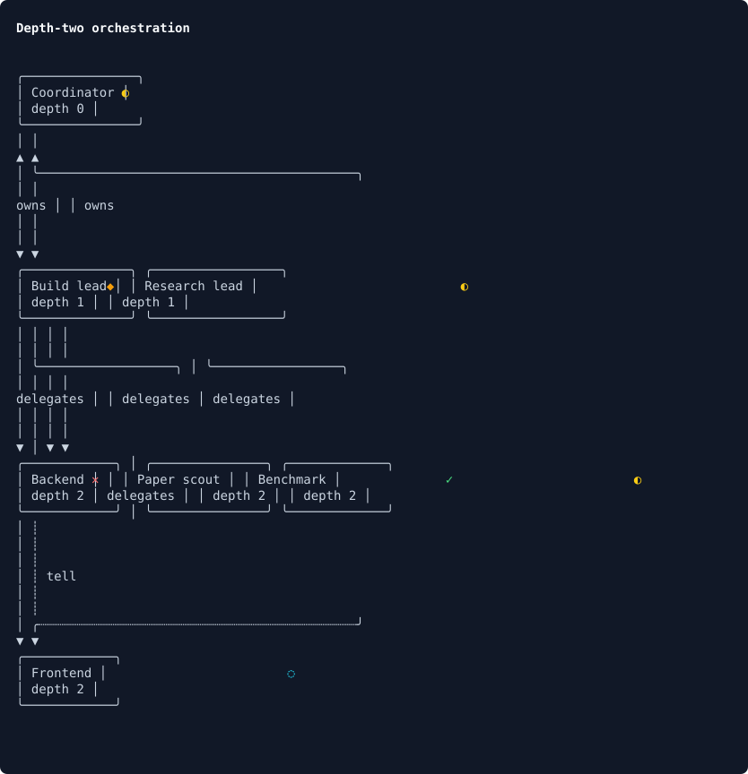
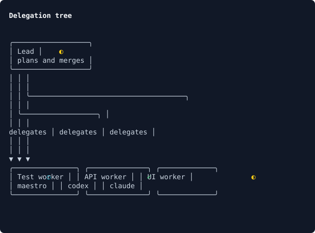
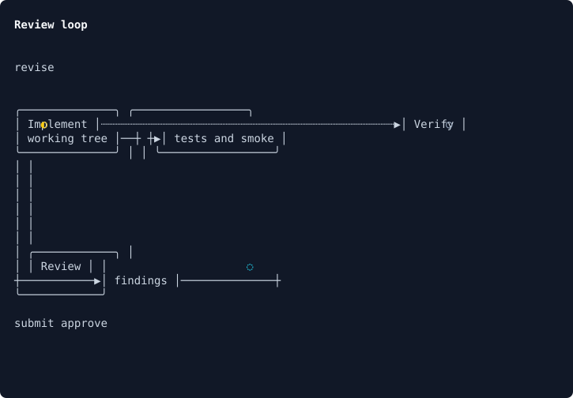
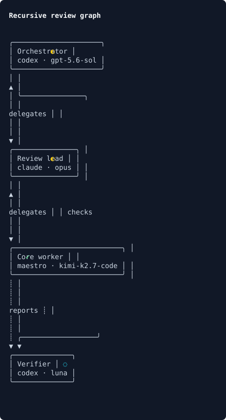

# Orchgraph

Graph engineering primitives for agentic orchestration.

Orchgraph turns a runtime-neutral graph document into an ELK-laid-out terminal
canvas. Agent runtimes keep ownership of execution, permissions, and state;
Orchgraph owns graph validation, layout, rendering, and viewport behavior.



## Install

```bash
npm install orchgraph
```

## Build a graph

```ts
import { layoutTerminalGraph, renderTerminalCanvas } from "orchgraph";

const canvas = await layoutTerminalGraph({
  title: "Review graph",
  nodes: [
    { id: "lead", label: "Review lead", state: "running" },
    { id: "worker", label: "Worker", detail: "codex" },
  ],
  edges: [
    {
      source: "lead",
      target: "worker",
      kind: "delegation",
      label: "delegates",
      direction: "both",
    },
  ],
});

console.log(renderTerminalCanvas(canvas, { color: process.stdout.isTTY }).join("\n"));
```

The graph document is deliberately small: nodes describe work and current
state, while edges describe delegation, verification, feedback, or any
application-defined relationship.

## Render live state

`layoutTerminalGraph` returns a clean, ANSI-free canvas. Apply terminal color
and animation only when writing a frame:

```ts
import { renderTerminalCanvas } from "orchgraph";

let animationFrame = 0;

setInterval(() => {
  const lines = renderTerminalCanvas(canvas, {
    color: true,
    animationFrame: animationFrame++,
  });
  process.stdout.write(`\u001b[H${lines.join("\n")}`);
}, 120);
```

Running nodes animate in bold yellow by default. Queued, blocked, succeeded,
and failed nodes have separate defaults. Hosts can replace any state style or
the running frames:

```ts
const lines = renderTerminalCanvas(canvas, {
  color: true,
  animationFrame,
  runningFrames: ["⠋", "⠙", "⠹", "⠸"],
  theme: {
    running: (marker, node) => `\u001b[38;5;214m${marker}\u001b[0m`,
    blocked: (marker, node) => `\u001b[7m${marker}\u001b[0m`,
  },
});
```

The decorator receives the full `TerminalNode`, including its state, bounds,
and marker position, so an existing TUI can use its own span or theme system
instead of ANSI.

## Embed in a TUI

Orchgraph does not own stdin, stdout, or the alternate screen:

```ts
import { terminalViewportLines } from "orchgraph/terminal";

const lines = terminalViewportLines(canvas, {
  x: 0,
  y: 0,
  width: 80,
  height: 24,
});
```

Canvas metadata exposes node bounds and edge cells for hit testing, panning,
selection, and live edge highlighting.

## CLI

```bash
npx orchgraph graph.json
cat graph.json | npx orchgraph --direction RIGHT --spacing 6 --color
```

## Examples

### Delegation tree

One coordinator fans work out to independent agents.



### Review loop

Implementation, review, and verification form an explicit feedback loop.



### Recursive team

A depth-two team combines ownership, delegation, and cross-team messaging.



Run all source examples locally:

```bash
bun run examples
npx orchgraph examples/depth-two.json --color
```

## Runtime boundary

Orchgraph is an npm library, not a runtime adapter. A host application projects
its domain objects into `GraphDocument`:

```text
runtime domain objects -> projection function -> GraphDocument -> Orchgraph
```

For Negotium, a local `subagent-graph-projection.ts` maps topics, delegation,
reporting, and tell grants into generic nodes and edges. Orchgraph does not
import Negotium or communicate with its nodes.

## Development stack

- TypeScript with strict mode
- Node.js 20+ runtime
- Bun for installs and tests
- ELK.js for deterministic layered layout
- Zod for the public JSON contract
- Framework-free Unicode terminal renderer
- Biome for linting and formatting

See [Architecture](docs/architecture.md).

## License

Apache-2.0
